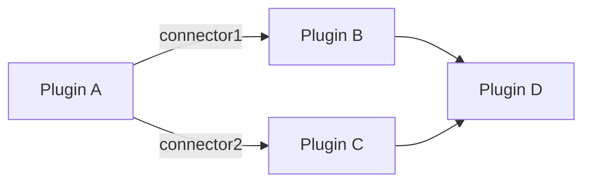

# NeuraCraft Core Types Reference

This document outlines the fundamental types used throughout the NeuraCraft toolkit. These types form the building blocks for creating and executing automation pipelines.

## PluginConfig

```typescript
interface PluginConfig {
  id: string;
  type: string;
  params?: Record<string, any>;
  connectors?: string[];
}
```

| Property     | Type                   | Description                                                                 | Required |
|--------------|------------------------|-----------------------------------------------------------------------------|----------|
| `id`         | string                 | Unique identifier for this plugin instance                                  | ✓        |
| `type`       | string                 | Plugin type (matches registered plugin names)                               | ✓        |
| `params`     | Record<string, any>    | Configuration parameters specific to this plugin type                       |          |
| `connectors` | string[]               | Output connectors that determine next plugin(s) in the pipeline             |          |

**Example:**
```typescript
{
  id: "sentiment-analysis-1",
  type: "textSentiment",
  params: {
    threshold: 0.7
  },
  connectors: ["high-confidence", "low-confidence"]
}
```

---

## PipelineSchema

```typescript
interface PipelineSchema {
  version: string;
  environment?: Record<string, string>;
  plugins: PluginConfig[];
  entryPoint: string;
}
```

| Property        | Type                   | Description                                                                 | Required |
|-----------------|------------------------|-----------------------------------------------------------------------------|----------|
| `version`       | string                 | Schema format version (e.g., "1.0")                                         | ✓        |
| `environment`   | Record<string, string> | Environment variables available to all plugins                              |          |
| `plugins`       | PluginConfig[]         | All plugin configurations in this pipeline                                  | ✓        |
| `entryPoint`    | string                 | ID of the initial plugin to execute                                         | ✓        |

**Usage Note:**  
Environment variables support `${VAR}` interpolation in plugin parameters.

---

## ContextualPayload

```typescript
interface ContextualPayload<T = any> {
  content: T;
  metadata: {
    timestamp: number;
    origin?: string;
    contentType: string;
    history: ExecutionHistory[];
  };
}
```

**Structure Breakdown:**

1. `content` (any type):
   - Primary data being processed
   - Structure varies by plugin type

2. `metadata`:
   - `timestamp`: Unix epoch time of payload creation
   - `origin`: Optional source identifier
   - `contentType`: MIME type or format descriptor
   - `history`: Array of previous processing steps (see ExecutionHistory below)

---

## ExecutionLog

```typescript
interface ExecutionLog {
  pluginId: string;
  timestamp: {
    start: number;
    end: number;
  };
  status: "success" | "error" | "skipped";
  outputConnector?: string;
  error?: {
    code: string;
    message: string;
    stack?: string[];
  };
  metrics?: Record<string, number>;
}
```

| Property          | Type                            | Description                                                     |
|-------------------|---------------------------------|-----------------------------------------------------------------|
| `pluginId`        | string                          | ID of the executed plugin                                       |
| `timestamp.start` | number                          | Execution start time (Unix epoch)                               |
| `timestamp.end`   | number                          | Execution completion time                                       |
| `status`          | string                          | Final execution state                                           |
| `outputConnector` | string                          | Connector used for next plugin routing                          |
| `error`           | ErrorObject                     | Error details (if status = "error")                             |
| `metrics`         | Record<string, number>          | Performance metrics (processing time, memory usage, etc.)       |

**ErrorObject Structure:**
```typescript
{
  code: "TIMEOUT" | "VALIDATION" | "RUNTIME" | "CUSTOM";
  message: string;
  stack?: string[];
}
```

---

## ExecutionHistory

```typescript
type ExecutionHistory = Omit<ExecutionLog, 'metrics'>;
```

Abridged version of ExecutionLog used in payload metadata history arrays.

---

## Type Safety Recommendations

1. **Content Validation:**  
```typescript
function isPluginConfig(config: any): config is PluginConfig {
  return typeof config?.id === "string" && 
         typeof config?.type === "string";
}
```

2. **Payload Type Guards:**  
Always validate payload content type at runtime:
```typescript
function isTextPayload(payload: ContextualPayload): payload is ContextualPayload<string> {
  return payload.metadata.contentType.startsWith("text/");
}
```

---

## Example Pipeline Flow



These core types enable NeuraCraft's modular architecture while maintaining strict type safety across plugin boundaries. For plugin-specific types, refer to individual plugin documentation.