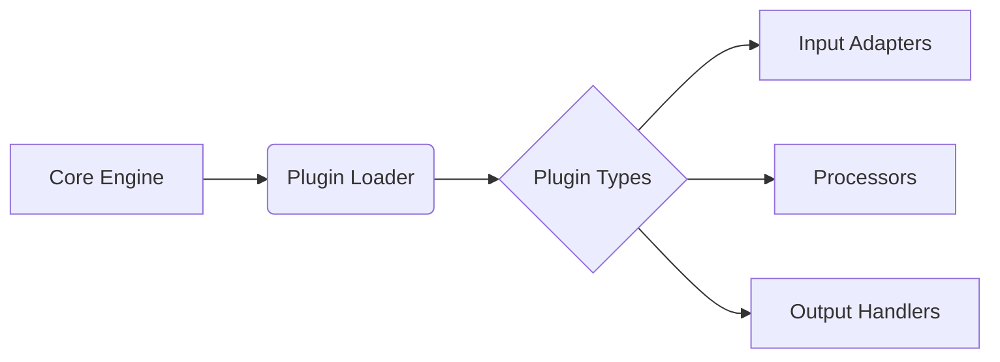
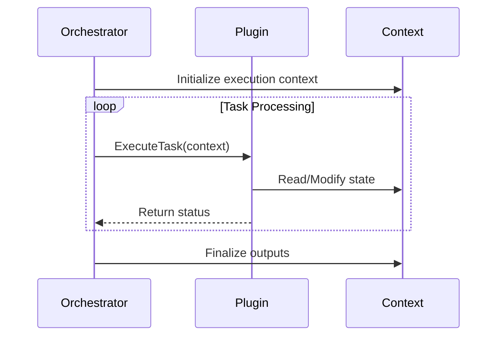

# NeuraCraft Architecture Overview

## Introduction
NeuraCraft is a lightweight, modular framework designed for building AI-driven automation pipelines. It emphasizes simplicity and extensibility, enabling developers to assemble complex workflows from reusable components while minimizing boilerplate.

## Design Principles
1. **Modularity**: All core capabilities are implemented as atomic, replaceable modules.
2. **Extensibility**: First-class plugin system with well-defined interfaces.
3. **Lightweight Execution**: <500KB core runtime with zero hard dependencies.
4. **Explicit Configuration**: Declarative pipeline definitions with version control support.
5. **Inversion of Control**: Dependency injection built-in for component wiring.

## Core Components

### 1. Pipeline Engine
- **Orchestrator**: Coordinates workflow execution through directed acyclic graphs (DAGs) 
- **Task Scheduler**: Implements priority queues and work stealing for optimal resource usage
- **State Manager**: Maintains pipeline context using content-addressable storage

### 2. Plugin System


### 3. Execution Context
- Shared memory space containing:
  - Current payload
  - Environment variables
  - System metadata
  - Error handling context
- Immutable by default with copy-on-write semantics

### 4. AI Integration Layer
- Unified interface for multiple providers (local LLMs, cloud APIs, hybrid)
- Automatic retry & fallback mechanisms
- Token usage telemetry
- Streaming response support

### 5. Configuration Subsystem
- Hierarchical config loading (environment > CLI > file > defaults)
- Type-safe validation using JSON Schema
- Hot-reloading capabilities

### 6. Observability Stack
- Structured logging (logfmt format)
- OpenTelemetry integration
- Prometheus metrics endpoint
- Built-in tracing visualization

## Pipeline Execution Flow
1. **Initialization**: 
   - Parse pipeline definition file
   - Resolve all plugin dependencies
   - Build execution graph

2. **Execution**:


3. **Completion**:
   - Persist final state
   - Emit end-of-pipeline metrics
   - Clean up ephemeral resources

## Plugin Architecture

### Lifecycle Hooks
| Phase          | Method               | Description                     |
|----------------|----------------------|---------------------------------|
| Initialization | `on_load()`          | Register capabilities           |
| Execution      | `process(payload)`   | Transform input data            |
| Shutdown       | `teardown()`         | Release resources               |

### Example Plugin Definition
```python
@neuracraft.plugin
class SentimentAnalyzer:

    def on_load(self, config):
        self.model = load_ai_model(config['model_path'])

    def process(self, payload, context):
        analysis = self.model.analyze(payload.text)
        return {**payload, 'sentiment': analysis}

    def teardown(self):
        self.model.release_gpu_memory()
```

## Scaling Characteristics
- **Vertical Scaling**: Single worker with multi-threaded execution
- **Horizontal Scaling**: Redis-backed distributed task queues
- **Hybrid Mode**: Mixed local/cloud processing with edge device support

## Extensibility Points
1. **Custom Plugins**
   - Input Sources (HTTP, filesystem, message queues)
   - Processing Units (AI models, data transformers)
   - Output Destinations (Databases, APIs, storage)

2. **Hooks System**
   - Pre/post execution callbacks
   - Error handling overrides
   - Custom telemetry endpoints

3. **Template Engines**
   - Support for Jinja2, Liquid, and Mustache
   - AI prompt templating DSL

## Performance Considerations
1. Concurrent execution cap: 256 parallel tasks (configurable)
2. Memory-optimized context passing
3. Lazy loading for heavyweight plugins
4. Pipeline warm-up system for time-critical applications

## Next Steps
Explore our [Plugin Development Guide](./plugin_development.md) or review [Sample Pipelines](./examples) to see NeuraCraft in action.