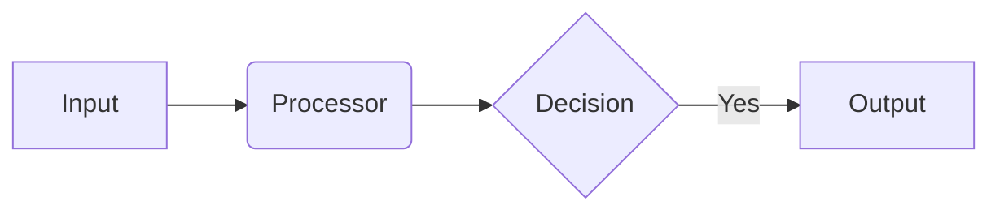

# NeuraCraft Style Guide

## 1. Purpose
This guide ensures our documentation is clear, consistent, and easy to maintain. Follow these standards for all Markdown files in the NeuraCraft project.

## 2. Language & Grammar
- **Voice**: Use active voice ("The plugin processes data" not "Data is processed by the plugin")
- **Contractions**: Use common contractions for friendly tone (it's, we'll, you're)
- **Pronouns**: Use "we" for project team, "you" for reader
- **Sentence Length**: Target 15-25 words maximum
- **Punctuation**:
  - Oxford comma required
  - No exclamation points in technical documentation
  - Use em dashes (--) for strong interruptions

### 2.1 Lists
- **Bulleted lists**:
  - Begin each item with capital letter
  - No ending punctuation for phrases
  - Use ending periods for complete sentences
- **Numbered lists**:
  - Use only for procedural steps
  - Include action verbs ("Press...", "Configure...")

## 3. Formatting Guidelines
| Element        | Formatting                       | Example                  |
|----------------|----------------------------------|--------------------------|
| UI Elements    | **Bold**                         | Click **Save Config**    |
| Emphasis       | _Italic_                         | _Do not_ restart service |
| Code Elements  | `Inline code`                    | Set `max_tokens=250`     |
| First Use      | **Bold** with definition         | Use **TensorPipe** (our data routing layer) |
| Notes          | Blockquote with ℹ️ emoji       | ℹ️ See configuration options below |
| Warnings       | Blockquote with ⚠️ emoji       | ⚠️ This will clear existing data |

## 4. Navigation
- Use relative paths for internal links:  
  `[Plugin API Reference](../api/plugins.md)`
- Avoid "click here":  
  `See [configuration options](#configuration) for details`

## 5. Markdown Conventions

### 5.1 Headers
- # H1: Page title only
- ## H2: Main sections
- ### H3: Subsections
- #### H4+ : Avoid in user-facing docs

### 5.2 Lists
```markdown
- For unordered lists
  - Indent two spaces for nested
  - Items align with parent bullet

1. Ordered lists
1. Use auto-numbering
1. Always start with 1.
```

### 5.3 Tables
```markdown
| Parameter | Type    | Default | Description          |
|-----------|---------|---------|----------------------|
| timeout   | integer | 300     | Operation timeout in seconds |
```

### 5.4 Code Blocks
  ```python
  # Specify language after triple backticks
  pipeline = NeuraPipeline()
    .load(JsonLoader())
    .transform(SentimentAnalysis())
  ```

### 5.5 Diagrams


## 6. Best Practices
- **Clarity First**: Avoid clever phrasing
- **No Placeholders**: All examples must be executable
- **Concise**: Omit unnecessary words
- **Terminology**:
  - "Pipeline" not "workflow"
  - "Plugin" not "module" or "extension"
- **Version Scope**: Document current behavior - don't reference future plans

## 7. Plugin Documentation Standards
Include this structure for each plugin:

```markdown
## ImageProcessor Plugin

**Purpose**: Resizes and optimizes images in workflow pipelines

**Configuration**:
```yaml
plugins:
  image_processor:
    target_size: 1024x768
    format: webp
    quality: 85
```

**Actions**:
| Method          | Parameters              | Output          |
|-----------------|-------------------------|-----------------|
| `resize()`      | width: int, height: int | ProcessedImage  |
| `convert()`     | format: str             | byte stream     |

**Example**:
```python
pipeline.use(ImageProcessor()
  .resize(800, 600)
  .convert('avif')
)
```
```

## 8. Code Blocks
- **Syntax Highlighting**: Always specify language
- **Placeholders**: Use UPPERCASE_ANGLED
  ```python
  api.connect(ENDPOINT_URL, API_KEY)
  ```
- **Testability**: All code examples must be executable

## 9. Legal & Compliance
- ™ Symbol on first use: NeuraCraft™
- Required copyright header (adjust year automatically):
  ```
  Copyright (c) 2024 NeuraCraft Project Contributors. Licensed under Apache 2.0.
  ```

---

_This document is version controlled with NeuraCraft v2.8+ - last validated 2024-03-15_